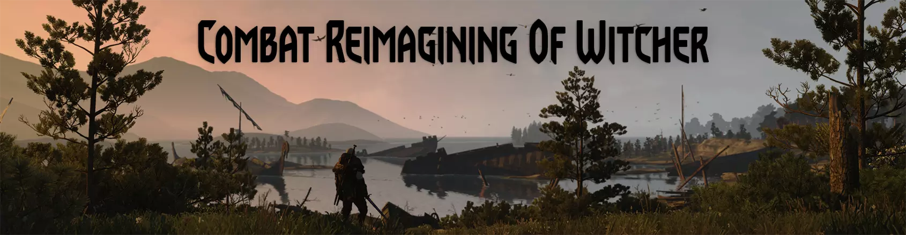

# CROW - Permissive combat modules
CROW is a modular package, it consists of multiple mods that you can install individually or combined.

- [CROW Combat Stamina](https://github.com/Aelto/tw3-crow/blob/master/src/modCrowCombatStamina/README.md): decreases the passive stamina regeneration but greatly reward landing successful hits by providing stamina regeneration buffs for a short duration
- [CROW Combat Defense](https://github.com/Aelto/tw3-crow/blob/master/src/modCrowCombatDefense/README.md): puts the counters (perfect parries) at the center of the combat system and transforms dodges into a positioning tool to create a truly melee & fast paced combat experience

# Combat Stamina
Unlike stamina systems where you are punished for doing actions by losing stamina, this mod goes the opposite way by drastically decreasing the stamina you'd get by playing passively (passive regeneration) and by giving you an incentive to play aggressively.

In terms of time investment (due to the attack animations) vs stamina regeneration gained, heavy attacks are far superior to fast attacks. This creates an incentive to go for a more aggressive but riskier fighting style whenever possible to maximize the stamina gain, indirectly causing you to play the best you can without applying any limits to what you can do.

# Combat Defense
As the player you are now able to parry everything, no exception even magical attacks. You are also able to parry whenever you want, be it in the middle of an attack or even of a previous parry, allowing you to chain parries as long as your timing is right. The parrying check does not depend on Geralt's guard animation anymore, pressing the key at the right time is all it takes.

Parrying an attack extends the duration of all CROW stamina regen buffs (you gained by attacking) by 1s but does not give any buff directly. Allowing you to gain even more stamina by countering the enemy attacks, but if you only rely on parries then you may lack the stamina regen you need for the crowd-control provided by signs.

Dodges were made faster, so fast they are now much more useful as a positioning tool and less useful as a dodging tool. Their duration being reduced halves the amount of i-frames you get from them, but you are also free to continue attacking much sooner.
## Dependencies
 - `mod_sharedutils_helpers`
 - `mod_sharedutils_storage`
 - `mod_sharedutils_customcooldowns`