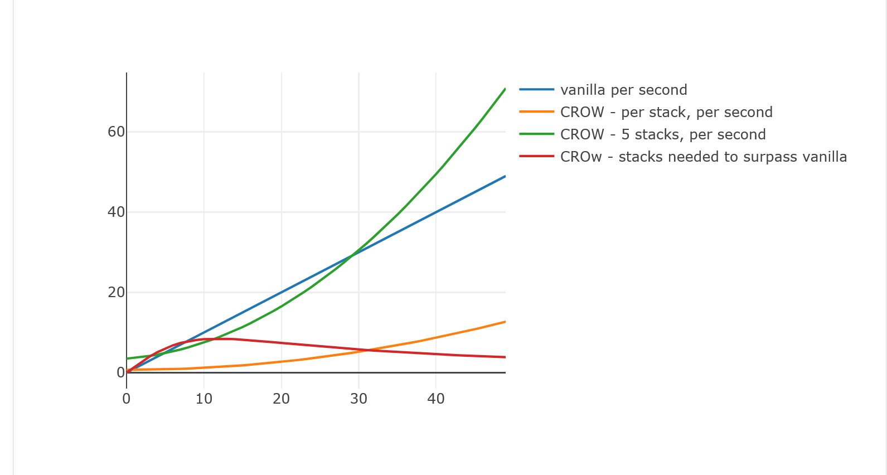

# CROW - Combat Stamina
The mod decreases the passive stamina regeneration heavily but adds a stamina
regeneration bonus when landing hits.

# Design

Unlike stamina systems where you are punished for doing actions by losing stamina,
this mod goes the opposite way by drastically decreasing the stamina you'd get
by playing passively (passive regeneration) and by giving you an incentive to play
aggressively.

In terms of time investment (due to the attack animations) vs stamina regeneration
gained, heavy attacks are far superior to fast attacks. This creates an incentive
to go for a more aggressive but riskier fighting style whenever possible to maximize
the stamina gain, indirectly causing you to play the best you can without applying
any limits to what you can do.

# In-depth explanation

- Landing a fast attack grants 1 stack of the buff for 10 seconds
- Landing a heavy attack grants 3 stacks of the buff for 10 seconds

Each stack of the buff grants `0.5 * ((x * x + 100) / 100) + 0.2` stamina per second
where `x` is the stamina regeneration per second you'd have without the mod, meaning
the base 10stamina/s affected by the gear you wear and the perks you have.

> A late game sign build can reach around 50 stamina per second after the Next Gen update

Here is a plot where the blue curve is the vanilla regen per second, the `X` axis
is the stamina regen you'd have without the mod, the `Y` axis the stamina you'll get
every second and the base stamina regeneration being 10 per second:

As you can see from the plot the higher the stamina regen (from the gear & perk bonuses)
the stronger the buff gets. Allowing you to gain a greater stamina regeneration
with less stacks.

> The value grows exponentially but remember that an attack takes at least 1 second
> to land and casting a sign takes a good second as well. Past a certain point
> you'll see diminishing returns as you'll have so much stamina regen you won't
> be able to use it all unless you spend time casting signs, which means you are
> not stacking buffs anymore and you're losing the future regeneration. Things
> balance themselves naturally.